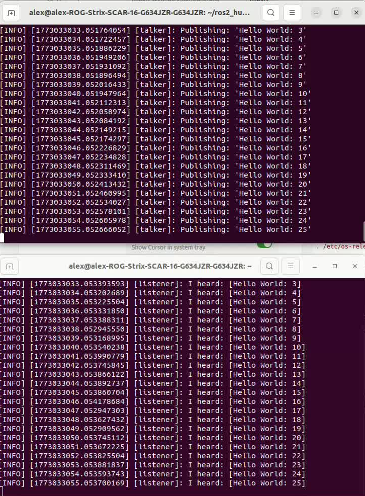
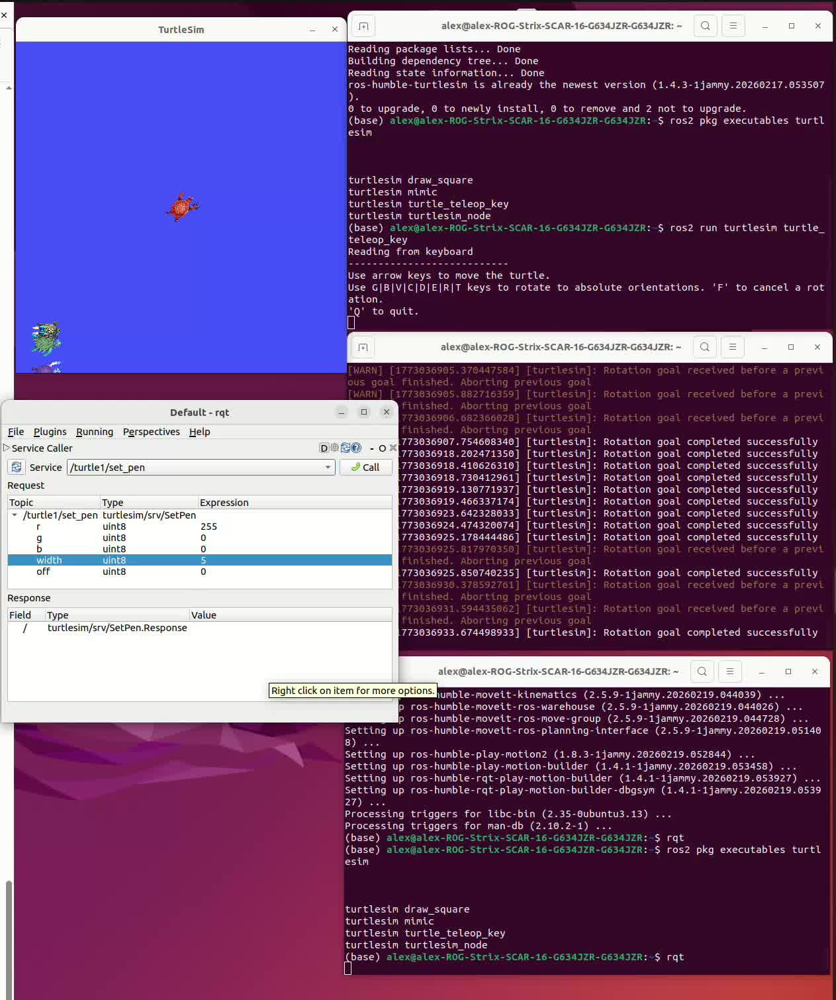

# 具身智能 (ubuntu)
## 学习资料
```
教程视频
https://www.bilibili.com/video/BV1Ci4y1L7ZZ/?share_source=copy_web&vd_source=11a996bfcadb0974aedb2833319e8296
代码
https://www.autolabor.com.cn/book/ROSTutorials/
```
## 上午
- ros 是一个标准化
  - 集成工具、库、协议
  - 分布式系统：理解为积木
- ros = plumbing + tools + capabilities + ecosystem
  - 通信
  - 工具：可以仿真
  - 功能：调参
  - 生态

## 下午
- install
  - try examples
  - turtlesim
    - 
  - node
  - topics